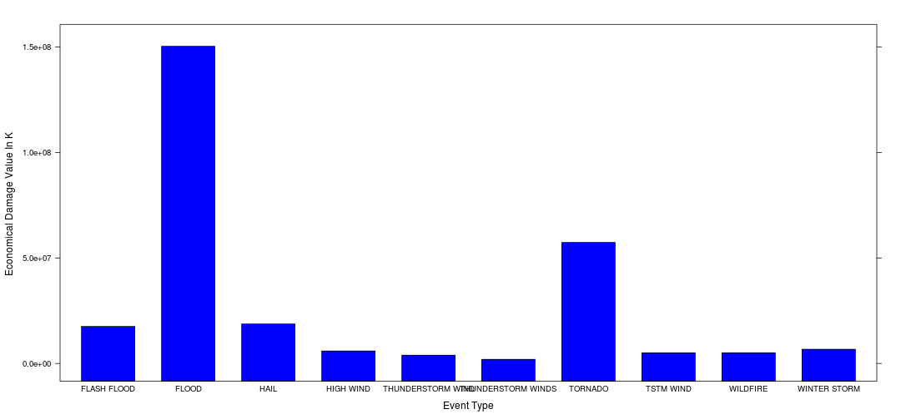

Title
========================================================

In this data analysis , we will try to focus on discovering and answering two questions . The first one is realted to discovering the most harmful events to the humans health that can cause many injures and fatalities? The seond one related to the events that carry the most harmful ecomomical consequences to the government and to the citizens.
For answering those questions we are going to analyze data collected from the NOAA Storm Database.

Synopsis
========================================================
1. The analysis starts with downloading the data and discovering the unusual values that its fields hold.
2. Then we started to organize the data and ignore the unsignificant values.
3. We started answering our questions based on our tidy data that are generated based on different assumptions.
4. For every question , we tried to create a tidy dataset that can be plotted easily and efficiently and can give us the appropriate answers to our questions.
5. Every answer contains barchart that shows the highest 10 event types that can cause the most harmful affects to the health of the citizens and for the economics of the government and the citizens.

Data Processing 
========================================================
#### I started the analysis by downloading the data from this link [ Dataset Link]  (https://d396qusza40orc.cloudfront.net/repdata%2Fdata%2FStormData.csv.bz2)
#### First we downloaded and loaded the data using the next R code .


```r
# f <- tempfile()
# download.file('https://d396qusza40orc.cloudfront.net/repdata%2Fdata%2FStormData.csv.bz2',
# f,method='curl') storm_data<-read.csv(bzfile(f))
storm_data <- read.csv("/host/Downloads/repdata-data-StormData.csv")
```

#### We can discover the names of the data by the next command

```r
storm_data_colNames <- names(storm_data)
print(storm_data_colNames)
```

```
##  [1] "STATE__"    "BGN_DATE"   "BGN_TIME"   "TIME_ZONE"  "COUNTY"    
##  [6] "COUNTYNAME" "STATE"      "EVTYPE"     "BGN_RANGE"  "BGN_AZI"   
## [11] "BGN_LOCATI" "END_DATE"   "END_TIME"   "COUNTY_END" "COUNTYENDN"
## [16] "END_RANGE"  "END_AZI"    "END_LOCATI" "LENGTH"     "WIDTH"     
## [21] "F"          "MAG"        "FATALITIES" "INJURIES"   "PROPDMG"   
## [26] "PROPDMGEXP" "CROPDMG"    "CROPDMGEXP" "WFO"        "STATEOFFIC"
## [31] "ZONENAMES"  "LATITUDE"   "LONGITUDE"  "LATITUDE_E" "LONGITUDE_"
## [36] "REMARKS"    "REFNUM"
```

#### From the names of the coloumns , we should notice that there are only some columns that could answer our questions. 

1. The event type that caused the disaster <font color="blue"> EVTYPE </font>
2. Number of fatalities lost thier life during the disaster <font color="blue"> FATALITIES</font>
3. Number of injures happened in the time of the disaster  <font color="blue"> INJURIES</font>
4. Property damage amount <font color="blue">  PROPDMG</font>
5. Property damage unit  <font color="blue"> PROPDMGEXP</font>
6. Amount of wasted crops  <font color="blue"> CROPDMG</font>
7. Unit of the amount od wasted crops  <font color="blue"> CROPDMGEXP</font>

##### So the next step will be to subset the columns that we are going to use in our analysis . 

```r
storms <- data.frame(EventType = storm_data$EVTYPE, FatalitiesCount = storm_data$FATALITIES, 
    InjuresCount = storm_data$INJURIES, PropertyDmgAmount = storm_data$PROPDMG, 
    PropertyDmgUnit = storm_data$PROPDMGEXP, CropsLostAmount = storm_data$CROPDMG, 
    CropsLostUnit = storm_data$CROPDMGEXP)
```

##### Then we can print summary for the data to see how the data looks like 

```r
str(storms)
```

```
## 'data.frame':	902297 obs. of  7 variables:
##  $ EventType        : Factor w/ 985 levels "?","ABNORMALLY DRY",..: 830 830 830 830 830 830 830 830 830 830 ...
##  $ FatalitiesCount  : num  0 0 0 0 0 0 0 0 1 0 ...
##  $ InjuresCount     : num  15 0 2 2 2 6 1 0 14 0 ...
##  $ PropertyDmgAmount: num  25 2.5 25 2.5 2.5 2.5 2.5 2.5 25 25 ...
##  $ PropertyDmgUnit  : Factor w/ 19 levels "","-","?","+",..: 17 17 17 17 17 17 17 17 17 17 ...
##  $ CropsLostAmount  : num  0 0 0 0 0 0 0 0 0 0 ...
##  $ CropsLostUnit    : Factor w/ 9 levels "","?","0","2",..: 1 1 1 1 1 1 1 1 1 1 ...
```

```r
summary(storms)
```

```
##              EventType      FatalitiesCount  InjuresCount   
##  HAIL             :288661   Min.   :  0     Min.   :   0.0  
##  TSTM WIND        :219940   1st Qu.:  0     1st Qu.:   0.0  
##  THUNDERSTORM WIND: 82563   Median :  0     Median :   0.0  
##  TORNADO          : 60652   Mean   :  0     Mean   :   0.2  
##  FLASH FLOOD      : 54277   3rd Qu.:  0     3rd Qu.:   0.0  
##  FLOOD            : 25326   Max.   :583     Max.   :1700.0  
##  (Other)          :170878                                   
##  PropertyDmgAmount PropertyDmgUnit  CropsLostAmount CropsLostUnit   
##  Min.   :   0             :465934   Min.   :  0.0          :618413  
##  1st Qu.:   0      K      :424665   1st Qu.:  0.0   K      :281832  
##  Median :   0      M      : 11330   Median :  0.0   M      :  1994  
##  Mean   :  12      0      :   216   Mean   :  1.5   k      :    21  
##  3rd Qu.:   0      B      :    40   3rd Qu.:  0.0   0      :    19  
##  Max.   :5000      5      :    28   Max.   :990.0   B      :     9  
##                    (Other):    84                   (Other):     9
```

####  If we tried to take a look on the event types that are in the dataset , we will see that the event types have messy values  .

```r
print(head(unique(storms$EventType)), 10)
```

```
## [1] "TORNADO"               "TSTM WIND"             "HAIL"                 
## [4] "FREEZING RAIN"         "SNOW"                  "ICE STORM/FLASH FLOOD"
## 985 Levels: "?" "ABNORMALLY DRY" "ABNORMALLY WET" ... "WND"
```

```r
print(tail(unique(storms$EventType)), 10)
```

```
## [1] "DENSE SMOKE"              "LAKESHORE FLOOD"         
## [3] "MARINE THUNDERSTORM WIND" "MARINE STRONG WIND"      
## [5] "ASTRONOMICAL LOW TIDE"    "VOLCANIC ASHFALL"        
## 985 Levels: "?" "ABNORMALLY DRY" "ABNORMALLY WET" ... "WND"
```

#### The event types contain many redundant values that are existed in many similar values .We can see capital,small values for the same event type or similar in the semantics as in this example <font color="blue">  "WINTER STORM/HIGH WIND" and "WINTER STORM HIGH WINDS" </font> .In the analysis, we are going to ignore those values as they don't have significiant affect on our analysis and we are going to focus only the main event types.
#### We will take the highest occuring 20 events . 

```r

event_types_frm <- data.frame(table(storms$EventType))
event_types_frm <- na.omit(event_types_frm[order(event_types_frm$Freq, decreasing = TRUE), 
    ])
event_types <- event_types_frm[1:20, 1]
names(event_types_frm) = c("EventType", "Frequencey")

print_fun <- function(df) {
    event = df[1]
    frequency = df[2]
    print_str = paste(sep = "", "Event Type(", event, ") ,Frequencey(", frequency, 
        ")")
    
}

apply(na.omit(event_types_frm[1:20, ]), 1, print_fun)
```

```
##                                                        238 
##                     "Event Type(HAIL) ,Frequencey(288661)" 
##                                                        854 
##                "Event Type(TSTM WIND) ,Frequencey(219940)" 
##                                                        759 
##        "Event Type(THUNDERSTORM WIND) ,Frequencey( 82563)" 
##                                                        830 
##                  "Event Type(TORNADO) ,Frequencey( 60652)" 
##                                                        147 
##              "Event Type(FLASH FLOOD) ,Frequencey( 54277)" 
##                                                        164 
##                    "Event Type(FLOOD) ,Frequencey( 25326)" 
##                                                        783 
##       "Event Type(THUNDERSTORM WINDS) ,Frequencey( 20843)" 
##                                                        354 
##                "Event Type(HIGH WIND) ,Frequencey( 20212)" 
##                                                        452 
##                "Event Type(LIGHTNING) ,Frequencey( 15754)" 
##                                                        304 
##               "Event Type(HEAVY SNOW) ,Frequencey( 15708)" 
##                                                        284 
##               "Event Type(HEAVY RAIN) ,Frequencey( 11723)" 
##                                                        972 
##             "Event Type(WINTER STORM) ,Frequencey( 11433)" 
##                                                        978 
##           "Event Type(WINTER WEATHER) ,Frequencey(  7026)" 
##                                                        210 
##             "Event Type(FUNNEL CLOUD) ,Frequencey(  6839)" 
##                                                        486 
##         "Event Type(MARINE TSTM WIND) ,Frequencey(  6175)" 
##                                                        485 
## "Event Type(MARINE THUNDERSTORM WIND) ,Frequencey(  5812)" 
##                                                        933 
##               "Event Type(WATERSPOUT) ,Frequencey(  3796)" 
##                                                        672 
##              "Event Type(STRONG WIND) ,Frequencey(  3566)" 
##                                                        917 
##     "Event Type(URBAN/SML STREAM FLD) ,Frequencey(  3392)" 
##                                                        953 
##                 "Event Type(WILDFIRE) ,Frequencey(  2761)"
```


#### To answer the first question we need to get the sum of the fatalities and injures for all the occured events .
##### Therefore we should know what event types in our dataset that have the highest bad impact. Therefore adding them tp small dataset that should contain the event types in addition to the sum of injures and fatalities for every event type.

```r

event_damage_fatalities <- lapply(event_types, function(x) {
    sum(storms[storms$EventType == x, 2], na.rm = TRUE) + sum(storms[storms$EventType == 
        x, 3], na.rm = TRUE)
})

event_damage_citizens <- data.frame(event = event_types, fatalities_count = unlist(event_damage_fatalities))

summary(event_damage_citizens)
```

```
##           event    fatalities_count
##  FLASH FLOOD : 1   Min.   :    3   
##  FLOOD       : 1   1st Qu.:  288   
##  FUNNEL CLOUD: 1   Median : 1067   
##  HAIL        : 1   Mean   : 6544   
##  HEAVY RAIN  : 1   3rd Qu.: 1904   
##  HEAVY SNOW  : 1   Max.   :96979   
##  (Other)     :14
```

```r
str(event_damage_citizens)
```

```
## 'data.frame':	20 obs. of  2 variables:
##  $ event           : Factor w/ 985 levels "?","ABNORMALLY DRY",..: 238 854 759 830 147 164 783 354 452 304 ...
##  $ fatalities_count: num  1376 7461 1621 96979 2755 ...
```

#####  Then we will able to plot a barchart to see which event has the most harmful affect on the population health , but before that let's get the  highest 10 events that are the most harmful on the population health.

```r
library(lattice)
df_draw <- na.omit(event_damage_citizens[order(event_damage_citizens$fatalities_count, 
    decreasing = TRUE), ][1:10, ])

print(df_draw)
```

```
##                event fatalities_count
## 4            TORNADO            96979
## 2          TSTM WIND             7461
## 6              FLOOD             7259
## 9          LIGHTNING             6046
## 5        FLASH FLOOD             2755
## 3  THUNDERSTORM WIND             1621
## 12      WINTER STORM             1527
## 8          HIGH WIND             1385
## 1               HAIL             1376
## 10        HEAVY SNOW             1148
```

```r
barchart(df_draw$fatalities_count ~ df_draw$event, xlab = "Event Type", ylab = "Number Of Fatalities and Injures", 
    col = "blue")
```


#### To answer the second question we need to conclude a formula that can be applied on our data.
##### So we will try to add the damage that is caused to the corps to the damage that affected the properties of the citizens .This can be caluclated by  multiplying the unit into the damage, but as we see that the unit is factor  so we should replace its values by numerice ones .We will replace   K and k by 1  M,m by 1000 and B,b by 1000000 any thing else will be replaced by zereos.
##### First we need to replace the values of the units by numeric values. 
##### Second we need to create new dataframe which has 2 coloumns the first one is the unique event types , the second one is the sum of the damage multiplied by the unit for the corps and for for the property

```r
storms$PropertyDmgUnit <- sapply(storms$PropertyDmgUnit, function(x) {
    ifelse(x %in% c("k", "K"), 1, ifelse(x %in% c("M", "m"), 1000, ifelse(x %in% 
        c("B", "b"), 1e+06, 0)))
    
})
storms$CropsLostUnit <- sapply(storms$CropsLostUnit, function(x) {
    ifelse(x %in% c("k", "K"), 1, ifelse(x %in% c("M", "m"), 1000, ifelse(x %in% 
        c("B", "b"), 1e+06, 0)))
    
})
str(storms)
```

```
## 'data.frame':	902297 obs. of  7 variables:
##  $ EventType        : Factor w/ 985 levels "?","ABNORMALLY DRY",..: 830 830 830 830 830 830 830 830 830 830 ...
##  $ FatalitiesCount  : num  0 0 0 0 0 0 0 0 1 0 ...
##  $ InjuresCount     : num  15 0 2 2 2 6 1 0 14 0 ...
##  $ PropertyDmgAmount: num  25 2.5 25 2.5 2.5 2.5 2.5 2.5 25 25 ...
##  $ PropertyDmgUnit  : num  1 1 1 1 1 1 1 1 1 1 ...
##  $ CropsLostAmount  : num  0 0 0 0 0 0 0 0 0 0 ...
##  $ CropsLostUnit    : num  0 0 0 0 0 0 0 0 0 0 ...
```

```r
damage_economical <- sapply(event_types, function(x) {
    
    sum(storms[storms$EventType == x, 4] * storms[storms$EventType == x, 5], 
        na.rm = TRUE) + sum(storms[storms$EventType == x, 6] * storms[storms$EventType == 
        x, 7], na.rm = TRUE)
})
df_ecomoical_draw <- data.frame(Events = event_types, EconomicalDamage = damage_economical)
print(na.omit(df_ecomoical_draw))
```

```
##                      Events EconomicalDamage
## 1                      HAIL        1.876e+07
## 2                 TSTM WIND        5.039e+06
## 3         THUNDERSTORM WIND        3.898e+06
## 4                   TORNADO        5.735e+07
## 5               FLASH FLOOD        1.756e+07
## 6                     FLOOD        1.503e+08
## 7        THUNDERSTORM WINDS        1.927e+06
## 8                 HIGH WIND        5.909e+06
## 9                 LIGHTNING        9.408e+05
## 10               HEAVY SNOW        1.067e+06
## 11               HEAVY RAIN        1.428e+06
## 12             WINTER STORM        6.715e+06
## 13           WINTER WEATHER        3.587e+04
## 14             FUNNEL CLOUD        1.946e+02
## 15         MARINE TSTM WIND        5.421e+03
## 16 MARINE THUNDERSTORM WIND        4.864e+02
## 17               WATERSPOUT        9.354e+03
## 18              STRONG WIND        2.402e+05
## 19     URBAN/SML STREAM FLD        6.680e+04
## 20                 WILDFIRE        5.061e+06
```

```r
summary(df_ecomoical_draw)
```

```
##           Events   EconomicalDamage  
##  FLASH FLOOD : 1   Min.   :1.95e+02  
##  FLOOD       : 1   1st Qu.:5.91e+04  
##  FUNNEL CLOUD: 1   Median :1.68e+06  
##  HAIL        : 1   Mean   :1.38e+07  
##  HEAVY RAIN  : 1   3rd Qu.:6.11e+06  
##  HEAVY SNOW  : 1   Max.   :1.50e+08  
##  (Other)     :14
```

#####  Then the last step will be getting the higher 10 values and draw it in barchart 

```r
df_ecomoical_draw <- na.omit(df_ecomoical_draw[order(df_ecomoical_draw$EconomicalDamage, 
    decreasing = TRUE), ][1:10, ])


barchart(df_ecomoical_draw$EconomicalDamage ~ df_ecomoical_draw$Events, xlab = "Event Type", 
    ylab = "Economical Damage Value In K ", col = "blue")
```



Results
========================================================
#### After analyzing the data we can find the answers for our questions in our barcharts, that can be summarized that the <font color="blue"> TORNADO, TSTM WIND, FLOOD, LIGHTNING, FLASH FLOOD, THUNDERSTORM WIND, WINTER STORM, HIGH WIND, HAIL, HEAVY SNOW </font> have the highest bad impact on the citizens health and <font color="blue"> FLOOD, TORNADO, HAIL, FLASH FLOOD, WINTER STORM, HIGH WIND, WILDFIRE, TSTM WIND, THUNDERSTORM WIND, THUNDERSTORM WINDS </font> have the highest bad impact on economics of the government and the citizens.
